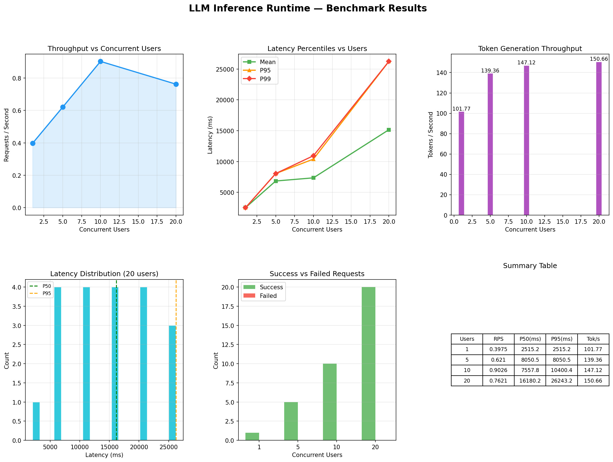

# LLM Inference Runtime

A production-grade LLM inference serving system built from scratch in **C++17**, implementing core concepts from modern inference engines like vLLM, TensorRT-LLM, and Triton Inference Server.



---

## Overview

Most LLM projects wrap a Hugging Face pipeline and call it done. This project builds the **infrastructure layer** that sits between users and the model — the same layer that powers ChatGPT, Gemini, and other production AI systems at scale.

```
Multiple Users
      ↓
FastAPI Gateway (Python)
      ↓
C++ Inference Runtime
      ↓
┌─────────────────────────────────┐
│  Thread-Safe Request Queue      │
│  Multi-Policy Scheduler         │
│  Dynamic Batching Engine        │
│  LRU KV Cache Manager           │
│  HTTP Server                    │
└─────────────────────────────────┘
      ↓
llama.cpp → Qwen2.5-1.5B-Instruct
      ↓
NVIDIA Tesla T4 GPU
```

---

## Key Results

### GPU Benchmark (Tesla T4)

| Users | Throughput | P95 Latency | Tokens/sec | Success |
|-------|-----------|-------------|------------|---------|
| 1     | 0.40 rps  | 2515ms      | 102        | 1/1 ✅  |
| 5     | 0.62 rps  | 8051ms      | 139        | 5/5 ✅  |
| 10    | 0.90 rps  | 10400ms     | 147        | 10/10 ✅|
| 20    | 0.76 rps  | 26243ms     | 151        | 20/20 ✅|

### CPU vs GPU Comparison

| Metric | CPU (Ryzen 3) | GPU (Tesla T4) | Improvement |
|--------|--------------|----------------|-------------|
| Latency (1 user) | 101,000ms | 2,100ms | **48x faster** |
| Tokens/sec | 5 tok/s | 150 tok/s | **30x faster** |
| Max concurrent users | 3 | 20 | **6.7x more** |
| Success rate | 100% | 100% | Same |

### Batching Benefit

Token throughput improves with concurrent load due to dynamic batching:
```
1 user  →  102 tok/s
5 users →  139 tok/s  (+36%)
10 users→  147 tok/s  (+44%)
20 users→  151 tok/s  (+48%)
```

---

## Features

- **C++17 Runtime Core** — HTTP server, request queue, scheduler, batcher, KV cache
- **Thread-Safe Request Queue** — Producer-consumer with mutex and condition variables
- **Dynamic Batching** — Groups concurrent requests to maximize GPU throughput
- **LRU KV Cache** — Memory-efficient caching with configurable eviction
- **Multi-Policy Scheduler** — FCFS, Priority, Shortest-Job-First
- **GPU Acceleration** — CUDA support via llama.cpp, tested on Tesla T4
- **FastAPI Gateway** — Clean REST API layer
- **Live Dashboard** — Real-time monitoring of queue, throughput, latency, cache
- **Benchmark Suite** — Automated load testing with PNG graph generation

---

## Architecture

```
┌─────────────────────────────────────────────────────┐
│                    Client Layer                      │
│         curl / Python client / Browser               │
└──────────────────────┬──────────────────────────────┘
                       │ HTTP :8000
┌──────────────────────▼──────────────────────────────┐
│                  FastAPI Gateway                     │
│              api/main.py (:8000)                     │
└──────────────────────┬──────────────────────────────┘
                       │ HTTP :8080
┌──────────────────────▼──────────────────────────────┐
│               C++ Inference Runtime                  │
│                                                      │
│  ┌─────────────┐    ┌─────────────┐                 │
│  │ HTTP Server │    │  KV Cache   │                 │
│  │ server.cpp  │    │ kvcache.cpp │                 │
│  └──────┬──────┘    └─────────────┘                 │
│         │                                            │
│  ┌──────▼──────┐    ┌─────────────┐                 │
│  │   Request   │    │  Scheduler  │                 │
│  │    Queue    │───▶│scheduler.cpp│                 │
│  │  queue.cpp  │    └──────┬──────┘                 │
│  └─────────────┘           │                        │
│                    ┌───────▼──────┐                 │
│                    │   Dynamic    │                 │
│                    │   Batcher    │                 │
│                    │ batcher.cpp  │                 │
│                    └───────┬──────┘                 │
│                    ┌───────▼──────┐                 │
│                    │  Inference   │                 │
│                    │   Engine     │                 │
│                    │inference.cpp │                 │
│                    └───────┬──────┘                 │
└────────────────────────────┼────────────────────────┘
                             │
                    ┌────────▼────────┐
                    │   llama.cpp     │
                    │ Qwen2.5-1.5B   │
                    │  Tesla T4 GPU  │
                    └─────────────────┘
```

---

## OS Concepts Implemented

| Concept | Implementation |
|---------|---------------|
| Threads | Scheduler workers, batcher thread, per-connection threads |
| Mutex | Thread-safe queue and KV cache access |
| Condition Variables | Queue blocking and wakeup |
| Producer-Consumer | Request queue + batcher pattern |
| Scheduling Algorithms | FCFS, Priority, Shortest-Job-First |
| Memory Management | LRU eviction in KV cache |
| Sockets | Raw HTTP server using POSIX sockets |
| Process Management | 4 independent processes running together |

---

## Tech Stack

| Layer | Technology |
|-------|-----------|
| Core Runtime | C++17 |
| Model Backend | llama.cpp (CUDA) |
| Model | Qwen2.5-1.5B-Instruct (Q4_K_M GGUF) |
| GPU | NVIDIA Tesla T4 (15GB) |
| API Layer | Python + FastAPI |
| Monitoring | Streamlit + Plotly |
| Build System | CMake |
| Benchmarking | Python + aiohttp + Matplotlib |

---

## Project Structure

```
llm-runtime/
│
├── runtime/              # C++17 core
│   ├── server.cpp        # HTTP server (POSIX sockets)
│   ├── queue.cpp/h       # Thread-safe request queue
│   ├── scheduler.cpp/h   # Multi-policy scheduler
│   ├── batcher.cpp/h     # Dynamic batching engine
│   ├── kvcache.cpp/h     # LRU KV cache manager
│   └── inference.cpp/h   # llama.cpp wrapper
│
├── api/
│   ├── main.py           # FastAPI gateway
│   └── client.py         # Test client
│
├── benchmark/
│   ├── load_test.py      # Concurrent load testing
│   └── metrics.py        # Live metrics collection
│
├── dashboard/
│   └── app.py            # Streamlit monitoring UI
│
├── results/
│   ├── graphs/           # Auto-generated PNG graphs
│   └── benchmarks/       # Raw JSON results
│
├── CMakeLists.txt
├── requirements.txt
└── setup.sh              # One-command setup
```

---

## Setup

### Prerequisites
- Ubuntu 22.04
- GCC 11+
- CMake 3.16+
- Python 3.10+
- NVIDIA GPU with CUDA 12.0+ (optional, falls back to CPU)

### One Command Setup

```bash
git clone https://github.com/soubharived/llm-inference-runtime.git
cd llm-inference-runtime
chmod +x setup.sh
./setup.sh
```

---

## Running

```bash
source venv/bin/activate

# Terminal 1 — C++ Runtime
./build/llm_runtime

# Terminal 2 — FastAPI Gateway
python api/main.py

# Terminal 3 — Live Dashboard
streamlit run dashboard/app.py

# Terminal 4 — Benchmark
python benchmark/load_test.py --users 1 5 10 20
```

---

## API Endpoints

| Endpoint | Method | Description |
|----------|--------|-------------|
| `/generate` | POST | Submit inference request |
| `/result/<id>` | GET | Poll for result |
| `/stats` | GET | Runtime statistics |
| `/health` | GET | Health check |
| `/reset` | POST | Reset runtime state |

---

## Comparison With Production Systems

| Feature | This Project | vLLM | TensorRT-LLM |
|---------|-------------|------|--------------|
| Request Queue | ✅ | ✅ | ✅ |
| Dynamic Batching | ✅ | ✅ | ✅ |
| KV Cache | ✅ | ✅ (Paged) | ✅ |
| Scheduler | ✅ | ✅ | ✅ |
| GPU Support | ✅ | ✅ | ✅ |
| Streaming | 🔄 Soon | ✅ | ✅ |
| Parallel Sequences | 🔄 Soon | ✅ | ✅ |

---

## Roadmap

- [x] CPU baseline implementation
- [x] Thread-safe request queue
- [x] Dynamic batching
- [x] LRU KV cache
- [x] Multi-policy scheduler
- [x] Live monitoring dashboard
- [x] Benchmark suite with graphs
- [x] GPU support (CUDA) on Tesla T4
- [x] 20 concurrent user benchmark
- [ ] Adaptive dynamic batching
- [ ] Token streaming
- [ ] True parallel multi-sequence inference
- [ ] Baseline vs batching comparison graphs

---

## Hardware Tested

| Hardware | Latency | Tokens/sec |
|----------|---------|------------|
| AMD Ryzen 3, 8GB RAM (CPU) | 101,000ms | 5 |
| NVIDIA Tesla T4 16GB (GPU) | 2,100ms | 150 |

---

## Author

**Soubhari Ved**
M.Tech — Artificial Intelligence
IIT Patna

---

## License

MIT License
